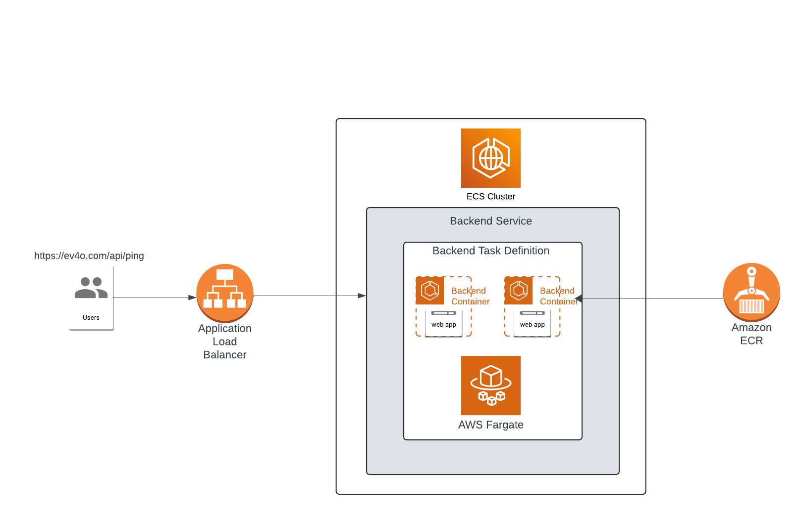
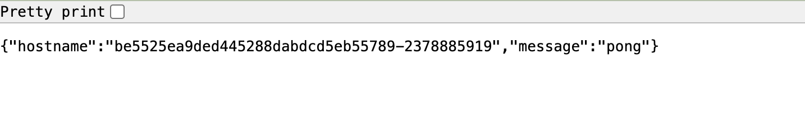
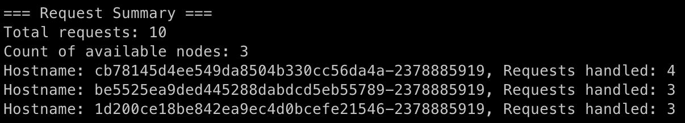

<h2 align="center">AI Capone Web App</h2>

## Overview

The AI Capone Web App is a simple application designed to handle HTTP/HTTPS requests on the /api/ping endpoint. It responds with a "pong" message along with the hostname of the server node that processed the request. The app is containerized using Docker, deployed to Amazon Elastic Container Service (ECS) using Terraform, and integrated with Jenkins for CI/CD automation.

<div align="center">

</div>

## Features
- **Web app with /api/ping Endpoint**: 
  - Responds with: 
    ```json
    {
      "message": "pong",
      "hostname": "<server-node-hostname>"
    }
    ```
- **Containerized with Docker**: The app is packaged as a Docker container for easy deployment.
- **AWS Infrastructure Deployment**:
  - Uses Terraform to provision the necessary AWS resources: VPC, ECS Cluster, and an Application Load Balancer (ALB).
  - The number of nodes in the ECS cluster is configurable.
- **CI/CD Pipeline with Jenkins**:
  - The Jenkins pipeline automatically builds, tests, and deploys the Docker container to AWS ECS when code is pushed to the repository.
- **Load Balancer Testing**:
  - A Python script sends multiple requests to the ALB and gathers information on how requests are distributed across nodes.

## Getting Started

### Prerequisites
- AWS Account
- Github Account
- Docker
- Terraform
- Jenkins (can be installed on an EC2 instance or locally)
- Python

### Files
* `web.py`: Source code for the Al Capone Web App.
* `Dockerfile`: Used to build the Docker image.
* `requirements.txt`: Contains the Python dependencies for the app.
* `terraform/`: Folder that contains the Terraform configuration files for AWS resources.
* `Jenkinsfile`: Defines the CI/CD pipeline for Jenkins.
* `lb_requests.py`: Python script that sends requests to the load balancer and collects node usage data.

### Deployment Components

The AI Capone web app deployment process involves the creation of essential components:

* **Amazon ECS (Elastic Container Service):** A fully managed container orchestration service used to run the Docker containers for the Al Capone web app.
* **AWS Fargate:** A serverless compute engine for containers that allows you to run Docker containers without managing the underlying infrastructure.
* **Amazon ECR (Elastic Container Registry):** A fully managed container registry where the Docker image for the Al Capone app is stored.
* **Amazon VPC (Virtual Private Cloud):** A virtual network that allows you to launch AWS resources (like ECS) in a logically isolated section of the AWS cloud.
* **Application Load Balancer (ALB):** Distributes incoming traffic across the ECS tasks running the Dockerized app to ensure even distribution of requests.
* **IAM Roles:** AWS Identity and Access Management roles that control access to AWS services for ECS, allowing services to interact securely.
* **EC2 (Elastic Compute Cloud):** AWS virtual servers where Jenkins or other services may run (if not using Fargate for the whole system).
* **Route 53 Zone:** DNS domain where the Application load balancer will be poiting to
* **Jenkins:** The CI/CD tool that automates the build, test, and deployment process for the Dockerized app.

### How does it work?
The web application runs on three ECS containers, managed by an ECS service. The custom domain (in this case, ev4o.com) is hosted in Route 53, which directs traffic to the fully qualified domain name (FQDN) of the Application Load Balancer (ALB) in front of the ECS cluster. The ALB is configured with an SSL certificate, ensuring that all requests are served securely over HTTPS, with HTTP requests automatically redirected to HTTPS.

A Jenkins pipeline continuously monitors the GitHub repository for changes. Whenever a new commit is pushed, the pipeline is triggered to build a new Docker image, push it to Amazon ECR, and deploy the updated image to the ECS service, ensuring that the latest version of the application is always running.

**Sample AI Capone App Response:**
<div align="center">

</div>

## Usage

### Deploy AWS infrastructure
Terraform creates all the necessary underlying infrastructure including VPC, ECR, IAM roles, ECS, EC2 instance. To deploy the infrastructure follow the steps below:

1. Authenticate to AWS by adding your Access and Secret keys:

   ```
   aws configure
   ```
2. Deploy the infrastructure to AWS via terraform:

   ```
   terraform init
   terraform plan
   terraform apply
   ```

### CI/CD Pipeline
The CI/CD Pipeline automates the process of building, testing, and deploying the Al Capone web app to AWS ECS. The pipeline is triggered automatically when new code is pushed to the GitHub repository. Pipeline is described in the Jenkinsfile

**Pipeline Steps:**
1. Build Docker Image: Jenkins builds the Docker image from the latest code.
2. Push to Docker Registry: The image is pushed to AWS ECR.
3. Deploy to ECS: Jenkins updates the ECS service with the new image.

### Load Balancer Testing Script
A Python script (lb_requests.py) is provided to test the load balancer. The script sends a specified number of requests to the ALB and reports:
* List of node hostnames handling the requests.
* Number of requests handled by each node.
* Total count of available nodes.

**Sample Output:**
<div align="center">

</div>
